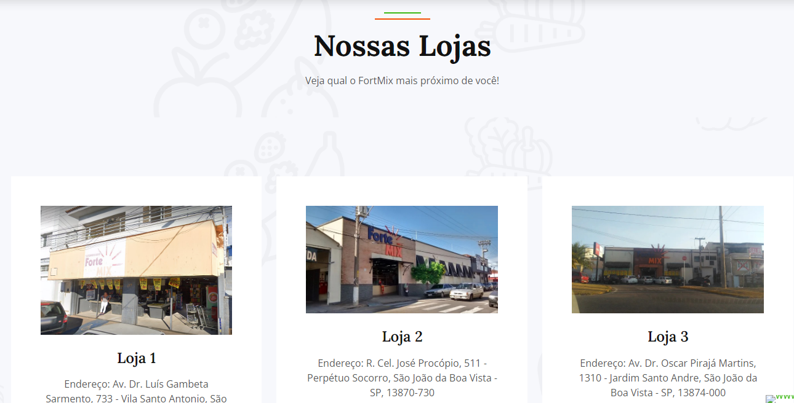
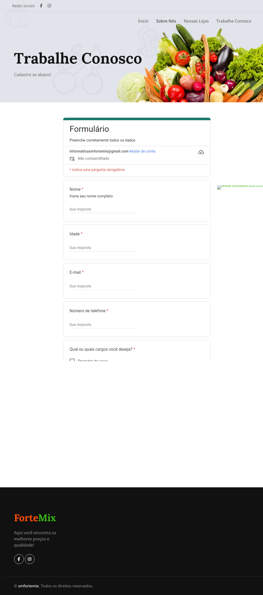

<h1> Site da Rede de Supermercados Fortemix </h1>
Este é um projeto de um site simples desenvolvido para a Rede de Supermercados Fortemix, com o objetivo de exibir informações sobre as lojas existentes, promover o APP de promoções e fornecer uma área de formulário para os interessados em se candidatar para vagas de emprego.

Inicialmente o formulário foi feito pelo Google Forms, trazendo praticidade e simplicidade no tratamento dos dados por planilha do Excel. 
Na medida que meu conhecimento for aumentando pretendo alterar para PHP.  

<h2> Tecnologias Utilizadas:
  
  
 

</h2>

<h3>Algumas imagens do site </h3>

